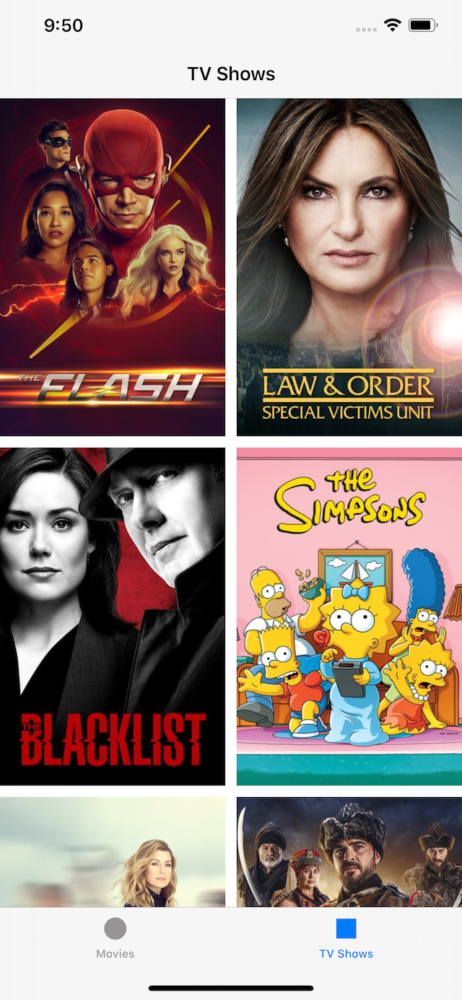
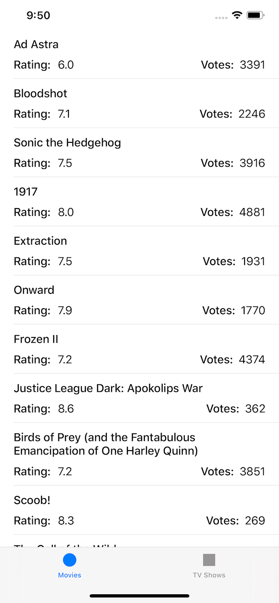

# TVShows

Sample application that allows to check out most popular tv shows and movies.

App loads data from [The Moview DB](https://www.themoviedb.org/). Before use it's required to generate API key and paste it into Constants.swift file.

Used technologies: Swift 5, UIKit, Autolayout (using storyboards and written from code), StackView, MVC, REST API. 

